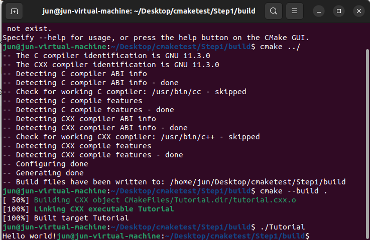
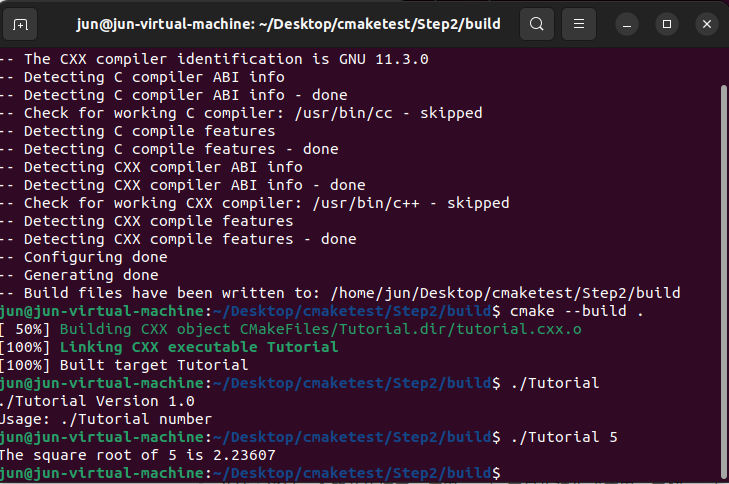

# 学习资料

官方：https://cmake.org/cmake/help/latest/guide/tutorial/index.html

官方学习源码：cmake-3.26.3-tutorial-source

从浅入深详细介绍CMake C++构建项目】https://www.bilibili.com/video/BV1BS4y1h7sU?p=5&vd_source=7fef10e53944b030e894b2dbe55612fd


# Step 1: A Basic Starting Point

- 起步，安装cmake、cmake-gui

```shell
$ sudo apt install cmake
$ sudo apt install cmake-gui
```

## Exercise 1 - Building a Basic Project

- 构建一个基本项目Step1以及build文件夹

```shell
$ mkdir Step1
$ mkdir build
```

- 编写 CMakeLists.txt
- 编写 tutorial.cxx
- 构建并可执行应用

```shell
$ cd build
$ cmake ../
$ cmake --build .
$ ./Tutorial
```

​	最后打印结果为hello world!




> 总结：通过一个简单的练习，使用cmake工具构建生成应用，了解cmake的简单编写


## Exercise 2 - Specifying the C++ Standard

指定标准c++

- 准备项目，复制Step1文件夹，重名Step2，清空build文件夹。项目实现的功能是：用户输入数字，开方运算

```shell
$ cp -r Step1 Step2
$ cd Step2
$ rm -rf build/*
```

- 修改CMakeList.txt，添加

```cmake
# 项目添加版本号
project(Tutorial VERSION 1.0)
# c++标准库
set(CMAKE_CXX_STANDARD 11)
set(CMAKE_CXX_STANDARD_REQUIRED True)
```

- 配置头文件`tutorial.h.in`，相当于cmake时，生成一个动态头文件

```c++
// 引用上面主版本1，小版本0
#define Tutorial_VERSION_MAJOR @Tutorial_VERSION_MAJOR@
#define Tutorial_VERSION_MINOR @Tutorial_VERSION_MINOR@
```

修改CMakeList.txt，添加

```cmake
configure_file(TutorialConfig.h.in TutorialConfig.h)
```

添加包含文件查找目录

```cmake
target_include_directories(Tutorial PUBLIC
                           "${PROJECT_BINARY_DIR}"
                           )
```

- 执行文件构建




# Step 2: Adding a Library

使用库


# Step 3: Adding Usage Requirements for a Library

按需使用库

Step3 Cmakelist.txt 包含目录

Step3.1 采用包含目录引用

学习lib采用目录方式包含

```cmake
target_include_directories(MathFunctions
          INTERFACE ${CMAKE_CURRENT_SOURCE_DIR}
          )
```


# Step 4: Adding Generator Expressions

- 构建编译选项

  比如使用C++标准库编译，先设置参数

  ```
  set(CMAKE_CXX_STANDARD 11)
  set(CMAKE_CXX_STANDARD_REQUIRED True)
  ```

​		

- 使用表达式构建编译选项
